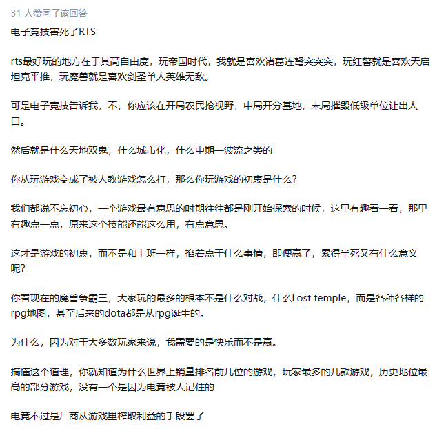

# 用户调研

即时战略游戏和大战略游戏也算是近亲了（

1. 玩家体验： 竞技化导致难度高，体验低，极化严重。 堆军队大决战的模式体验更好。 
2. 游戏定位： 战略游戏 不应该做成 凯申模拟器，回归战略本质。 （三大战役的模式才符合战略游戏的定位，现在的即时战略游戏认为玩家都能四渡赤水，然后大部分人都只会电令机枪移动五米）
3. AI应用： 辅助玩家，结盟游戏；戏精演员，花式输比赛； 群体的低智能的AI给军队单位，解放玩家双手，减少微操。 

以下是原文 以上是总结

## 为什么即时战略游戏越来越落寞？

当一个游戏的玩家都在赞扬一个游戏难度高让小白入不了门只能无能狂怒，“睿智你不连两千小时也配和我们玩”时，这游戏离死就不远了

1、RTS的中高端玩法的本质：从一个复杂系统里找到[最优解](https://www.zhihu.com/search?q=最优解&search_source=Entity&hybrid_search_source=Entity&hybrid_search_extra={"sourceType"%3A"answer"%2C"sourceId"%3A2591917710})，并同步操作实现。

这个需要大量的操作积累经验。

2、RTS的[王者局](https://www.zhihu.com/search?q=王者局&search_source=Entity&hybrid_search_source=Entity&hybrid_search_extra={"sourceType"%3A"answer"%2C"sourceId"%3A2591917710})的本质：从一个复杂且几乎所有变量都是即时生成的系统里找到最优解，并同步操作实现，且将这一操作带来的变量也演算并应对掉。

这个已经接近[围棋](https://www.zhihu.com/search?q=围棋&search_source=Entity&hybrid_search_source=Entity&hybrid_search_extra={"sourceType"%3A"answer"%2C"sourceId"%3A2591917710})这样的纯算力竞争，外加手快。

3、RTS的低端局，20年前构成市场辉煌的真正基本盘，它的本质是：从一个半开放的场景和一个半线性化的游戏流程里，玩出最大程度的自由性、开放性。

前半句决定RTS不是手游[塔防](https://www.zhihu.com/search?q=塔防&search_source=Entity&hybrid_search_source=Entity&hybrid_search_extra={"sourceType"%3A"answer"%2C"sourceId"%3A2591917710})，后半句决定RTS不是[模拟经营](https://www.zhihu.com/search?q=模拟经营&search_source=Entity&hybrid_search_source=Entity&hybrid_search_extra={"sourceType"%3A"answer"%2C"sourceId"%3A2591917710})。

作者：DiaSchisma
链接：https://www.zhihu.com/question/36160228/answer/2591917710
来源：知乎
著作权归作者所有。商业转载请联系作者获得授权，非商业转载请注明出处。

就提出了一个设想。

现实中，将军指挥军队，不是靠一个人亲自微操机枪向前5米，而是有一个中下层军官团队的，将军只是对着沙盘制定计划和下达指令。那么其实我们可以让AI去担当，中下层军官团队的角色。

隔壁RPG，为了解决即时制下，操作多个单位（队友）的问题，除了经典的[可暂停回合制](https://www.zhihu.com/search?q=可暂停回合制&search_source=Entity&hybrid_search_source=Entity&hybrid_search_extra={"sourceType"%3A"answer"%2C"sourceId"%3A2634259450})（值得一提的是，RTS现在也开始出现了，比如之前[英雄连3](https://www.zhihu.com/search?q=英雄连3&search_source=Entity&hybrid_search_source=Entity&hybrid_search_extra={"sourceType"%3A"answer"%2C"sourceId"%3A2634259450})测试版，单机模式就加入了可暂停即时制模式），也尝试过让玩家自己编辑队友AI的方案，比如玩过[龙腾世纪1](https://www.zhihu.com/search?q=龙腾世纪1&search_source=Entity&hybrid_search_source=Entity&hybrid_search_extra={"sourceType"%3A"answer"%2C"sourceId"%3A2634259450})和FF的玩家应该很熟悉了。

而可编程RTS也确实有人做出了实验品：

Screeps: World
[https://store.steampowered.com/app/464350/Screeps_World/](https://link.zhihu.com/?target=https%3A//store.steampowered.com/app/464350/Screeps_World/)
RTS的先锋派尝试之一，传说中的可编程自动化RTS。
玩家用特殊版本的JavaScript自己写AI，在线挂机24小时战斗，玩这游戏的玩家都是秃头罢……

同时，现在机器学习技术很火，什么"AI玩星际2"什么的玩法也不少见。

甚至现实中的战争，也在尝试探索无人化。

我们也许可以尝试RTS里面，设计一个可编程AI功能，甚至集成一个简易版的机器学习模块，让玩家自己去设计AI。

当然考虑到编程/训练AI，对玩家来说有些过于硬核了，所以可以搞一个AI版"[创意工坊](https://www.zhihu.com/search?q=创意工坊&search_source=Entity&hybrid_search_source=Entity&hybrid_search_extra={"sourceType"%3A"answer"%2C"sourceId"%3A2634259450})"，大佬开发AI分享出来大家使用，让玩家自己组建AI军官团。——或者说，就像即时战术配兵表，卡牌游戏攒卡组一样，把一部分现场决策的内容，提前到战前准备上。

玩家把这些AI"任命"为自己的基层军官，框框A/在地图上画进攻线，委任AI自动进攻，或者亲自操作主队进攻，AI负责微操和副队。——[钢铁雄心4](https://www.zhihu.com/search?q=钢铁雄心4&search_source=Entity&hybrid_search_source=Entity&hybrid_search_extra={"sourceType"%3A"answer"%2C"sourceId"%3A2634259450})的玩家应该很熟悉，画线制定计划+AI执行+自己操作少量高达师。

只不过运用在RTS上，逻辑复杂得多，并且可以下达多种的[预设命令](https://www.zhihu.com/search?q=预设命令&search_source=Entity&hybrid_search_source=Entity&hybrid_search_extra={"sourceType"%3A"answer"%2C"sourceId"%3A2634259450})。

作者：dumplingpro
链接：https://www.zhihu.com/question/36160228/answer/2634259450
来源：知乎
著作权归作者所有。商业转载请联系作者获得授权，非商业转载请注明出处。

没那么复杂，就是累。知道为什么[星际2](https://www.zhihu.com/search?q=星际2&search_source=Entity&hybrid_search_source=Entity&hybrid_search_extra={"sourceType"%3A"answer"%2C"sourceId"%3A2628529882})的合作模式比pvp更火么？就是因为可以轻松F2A以及抱队友大腿。以免费三杰为例，雷弱可以全图丢兵丢坦克丢飞机大和，凯姐可以瞬间铺升级版带反隐的[坑道虫](https://www.zhihu.com/search?q=坑道虫&search_source=Entity&hybrid_search_source=Entity&hybrid_search_extra={"sourceType"%3A"answer"%2C"sourceId"%3A2628529882})，最强指挥官可以满地图丢能量场、除了探姬之外的所有单位都可以瞬间折越而且还有三次折越次数。这就使集结部队的时候前线打到哪兵力就能直接补充到哪，非常方便。

191 人赞同了该回答

没那么复杂，就是累。知道为什么[星际2](https://www.zhihu.com/search?q=星际2&search_source=Entity&hybrid_search_source=Entity&hybrid_search_extra={"sourceType"%3A"answer"%2C"sourceId"%3A2628529882})的合作模式比pvp更火么？就是因为可以轻松F2A以及抱队友大腿。以免费三杰为例，雷弱可以全图丢兵丢坦克丢飞机大和，凯姐可以瞬间铺升级版带反隐的[坑道虫](https://www.zhihu.com/search?q=坑道虫&search_source=Entity&hybrid_search_source=Entity&hybrid_search_extra={"sourceType"%3A"answer"%2C"sourceId"%3A2628529882})，最强指挥官可以满地图丢能量场、除了探姬之外的所有单位都可以瞬间折越而且还有三次折越次数。这就使集结部队的时候前线打到哪兵力就能直接补充到哪，非常方便。

即时战略本身应该是我的战略比你好，或者小规模的，我的队伍组成克制你，或者科技高于你，或者战术上出奇制胜。

但实际上现在几乎所有的RTS都是你需要操作每一个单位，每一个单位的每一个操作都需要你亲自操作。在这个思路下带来的才是极高的操作上限和极高的入门门槛。

根本上RTS就对不起即时战略这四个字，什么活我都干了和战略有什么关系呢？这个问题大概要以回合制类型或者类似星际酒馆自动模式，以及未来可能存在的进一步的AI进化来解决了。

作者：非生物
链接：https://www.zhihu.com/question/36160228/answer/2498605216
来源：知乎
著作权归作者所有。商业转载请联系作者获得授权，非商业转载请注明出处。

230 人赞同了该回答

不想着服务绝大多数玩家，而去迎合一小撮“核心”玩家，RTS游戏的发展完全被带去了歪路上看小人互相打本来是很有成就感的事情，然后游戏厂商非要把RTS变成微操游戏强AI本来是非常有利于RTS游戏突围的玩意，可以作为玩家的强辅助，结果有一家给RTS加这个了嘛现在的RTS游戏就是个微操游戏罢了有多少人会喜欢这种类型的PVP？好好的上帝不当，非要去当常凯申，作为领袖非要拍电报要求X军X师…X排的某机枪手向左移动2M是吧

